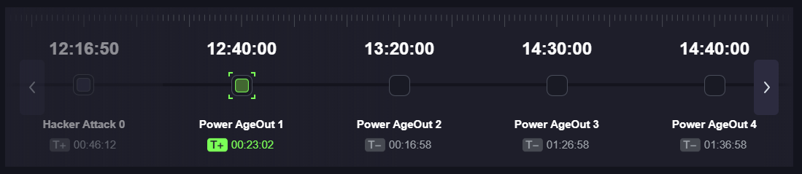
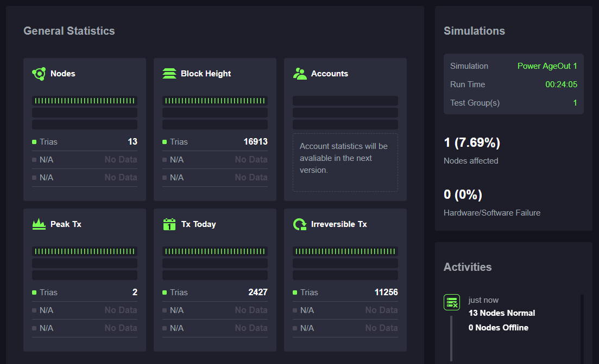
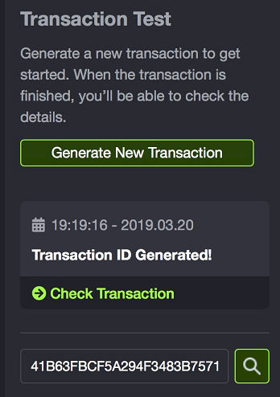
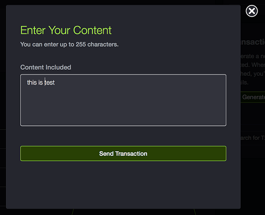
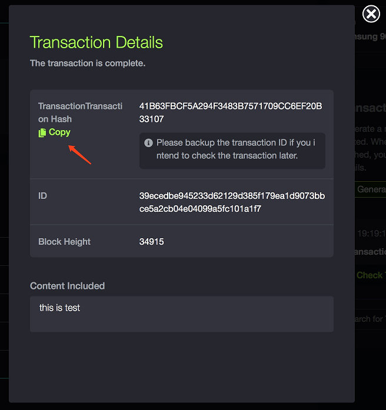

# Trias Beta User Manual
Trias Beta is for demonstrating Trias' latest technology, it also enables users to analyze how the products are being affected by various simulations.

**Please Note: Some features may not available on the current version.**

# Table of Contents

<!-- TOC -->
- [Chain Status Tab](#chain-status-tab)
    - [Simulations Review](#simulations-review)
    - [Chain Status and Visualisation](#chain-status-and-visualisation)
    - [General Statistics](#general-statistics)
    - [TPS Monitoring](#tps-monitoring)
    - [Fault Acceptance Rate](#fault-acceptance-rate)
    - [Faulty Nodes](#faulty-nodes)
    - [Simulations](#simulations)
    - [Activities](#activities)
    - [Hardware Specifications](#hardware-specifications)
    - [Transaction Test](#transaction-test)
- [Activities Tab](#activities-tab)
- [Node List Tab](#node-list-tab)
<!-- /TOC -->

# Chain Status Tab

## Simulations Review

All simulations in the current session can be checked on this card. Allowing users to review future and past simulations or check the one is undergoing. If there's a great number of simulations in the current session, you may need to slide on the card to view them all.

## Chain Status and Visualisation

This part shows a diagram of nodes from different test groups, with the node list on the right. You can switch test groups with the tab bar beside the card title. The faulty nodes will be marked with red color.

With Trias test group selected, the node list will mark the higher ranking nodes with a "Premium" badge, performance would affect the nodes' ranking.

## General Statistics

The users can compare real-time statistics from different test groups to see their performance under current simulation. 

Statistics including:

* **Nodes:** The number of nodes;
* **Block Height:** Current block height;
* **Peak Tx:** Peak transactions per second value from yesterday;
* **Tx today:** The number of transactions confirmed today;
* **Irreversible Tx:** Total confirmed transactions.

## TPS Monitoring

The x-axis in the chart shows the timeline while the y-axis shows the TPS value. The chart also marked the episodes of different simulations so the users can analyze the impact conveniently. The speedometers indicate real-time parameters.

Toggle different tabs to switch time range. Click "Return to Now" will reset the chart and refresh the data.

## Fault Acceptance Rate

Similar to [TPS Monitoring](##tps-monitoring).

## Faulty Nodes

Similar to [TPS Monitoring](##tps-monitoring).

## Simulations

This part shows a summary of the current simulation.

## Activities

The users can find all sorts of notifications here, including **machine offline, ranking update, simulation events, node status update**. Click "View all" to review all history activities.

## Hardware Specifications

The hardware we used in the test groups is listed here.

## Transaction Test

Transaction test helps the users to understand how information is stored on the blockchain. Get started by clicking the "Generate New Transaction" button, users can input custom message in the popup window, then click "Send Transaction".

Confirmed transactions will be shown as a transaction card, click "Check Transaction" button to check transaction detail. If you need to check the transaction later, be sure to back up the transaction hash, since the transaction history will be cleared after reloading the webpage.

When checking a transaction you backed up, paste the transaction hash into the search bar, click enter. If the transaction exists, you'll see the transaction details popup, otherwise, please check if you input a valid hash.

If something goes wrong during the process, please follow the instructions on the popup window. **Please Note: Even the error message says the transaction may not exist, there is still chance that the transaction is confirming, you can check again a moment later to be sure.**

# Activities Tab

Activities tab contains all the history activities, you can refine the result with the group filter and the date selector.

# Node List Tab

Node list tab helps users to check the expanded detail of nodes.
